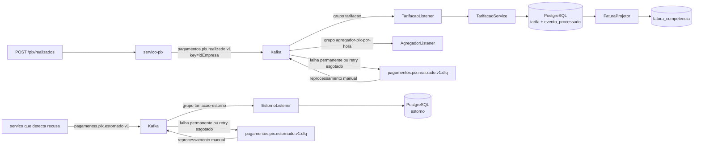

# Arquitetura do sistema de tarifacao de Pix PJ

## 1. O dominio

O sistema responde quanto uma empresa deve pagar pelos Pix liquidados em cada competencia
mensal. Cada Pix e confrontado com a oferta vigente da empresa: pode consumir franquia, gerar
tarifa por faixa, completar parcialmente o teto ou ser registrado sem cobranca.

A unidade de consistencia e `(idEmpresa, competencia)`. A decisao e feita no consumo do evento;
a fatura mensal e uma projecao derivada dos fatos.

## 2. Os eventos

O evento principal e `PixRealizado`, publicado em `pagamentos.pix.realizado.v1`. Seu contrato
completo esta em [docs/contrato.md](contrato.md). A identidade CloudEvents `ce_id` e a chave de
deduplicacao.

Quando uma validacao posterior recusa um efeito ja aplicado, o sistema publica o fato novo
`PixEstornado` em `pagamentos.pix.estornado.v1`. Ele carrega `eventoId`, `eventoOriginalId`,
`estornadoEm`, `idTransacaoPix`, `idEmpresa`, `valor` e `motivo`. O consumidor grava esse fato em
`estorno`; ele nao modifica a linha original de `tarifa`.

## 3. O desenho

O produtor usa `idEmpresa` como chave para manter os Pix da mesma empresa em uma particao e em
ordem para o grupo de tarifacao. Os grupos sao independentes: o agregador nao rouba eventos do
consumidor de tarifacao.

## 4. As decisoes

- [ADR-002](adr/ADR-002-dominio-do-projeto.md): empresa sem contrato nao e cobrada; a
  consequencia aceita e registrar linhas `SEM_CONTRATO` com valor zero.
- [ADR-003](adr/ADR-003-chave-de-particao.md): a chave e `idEmpresa`; a consequencia aceita e
  concentrar empresas quentes em uma particao.
- [ADR-005](adr/ADR-005-event-sourcing.md): `tarifa` e o historico do ciclo; a consequencia
  aceita e manter o log e reprojetar a fatura quando necessario.
- [ADR-006](adr/ADR-006-resiliencia.md): retry limitado, DLQ e compensacao por evento; a
  consequencia aceita e consistencia eventual no ajuste da fatura.

## 5. Quando falha

Falha transitoria e retentada cinco vezes com backoff de 1s a 16s. Falha permanente, como JSON
invalido, vai diretamente para a DLQ. O recoverer preserva `ce_*` e acrescenta o motivo nos
cabecalhos de dead letter. O reprocessamento e manual: depois de corrigir a causa, o operador
republica no topico original. O `ce_id` impede efeito duplicado.

A compensacao e outro caminho assincrono. Um `PixEstornado` pode falhar como qualquer outro
evento; nesse caso vai para retry/DLQ do proprio topico. Quando chega, a linha de `estorno` e
inserida em transacao e a fatura passa a mostrar `total_tarifado - total_estornado`.

## 6. Quando cresce

O primeiro gargalo esperado e o PostgreSQL, porque cada evento faz deduplicacao, leitura da oferta,
decisao e insercao na mesma transacao. O segundo e o lag de uma particao quente. Pode-se aumentar
consumidores ate o numero de particoes, mas isso nao paraleliza eventos da mesma empresa: a chave
preserva a ordem necessaria para o read-then-write da franquia e do teto.

A escala segura e horizontal entre empresas e grupos. Para uma empresa muito quente, a alternativa
futura e isolar o fluxo dela em outro topico e ciclo, com migracao por cutover e lag zero.

## 7. O que se enxerga

As tres perguntas operacionais principais sao:

1. **Existe mensagem parada?** Verificar consumer lag por particao; lag concentrado indica
   bloqueio ou consumidor indisponivel.
2. **Por que o evento nao foi processado?** Consultar a DLQ, os cabecalhos `kafka_dlt-*` e os
   `ce_*` preservados.
3. **A fatura esta atrasada?** Comparar `MAX(tarifa.versao)` com
   `fatura_competencia.versao_projetada` e comparar `total_estornado` com a soma de `estorno`.

Os logs registram particao, offset, tentativa, evento, empresa, competencia e situacao. O estado
final observavel fica em `tarifa`, `estorno` e `fatura_competencia`.

## 8. O que ficou de fora

Nao ha interface operacional, alerta integrado, retry com topicos temporais nem reprocessamento
automatico. O caminho manual foi escolhido para manter a decisao pequena e demonstravel. Tambem
nao ha snapshot do event store nem arquivamento frio de competencias antigas; fazer isso exige uma
politica de retencao fiscal, armazenamento de arquivo e procedimento de restauracao testado.
